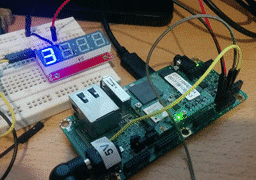
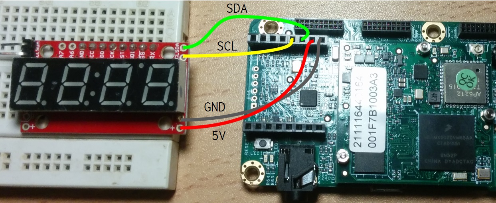

# AndroidThingsCounter

A simple Android Things app that displays a running counter on a I2C Seven Segment display.

It runs on the [PICO-IMX6UL](http://www.wandboard.org/index.php/details/pico-imx6ul) board, but can be easily adapter to run on Raspberry Pi 
by changing the i2c bus name in [HomeActivity.java](app/src/main/java/org/urish/androidthingscounter/HomeActivity.java).

## Build your own

1. Get a Serial 7-Segment display, such as [this one](https://www.sparkfun.com/products/11442)
2. You need to connect 4 wires: SCL, SDL, VCC (+) and GND (-) to the relevant pins on your board
3. Load this project in Android Studio and deploy it to your device

Wiring diagram for the PICO-IMX6UL:

## License

Copyright (C) 2016, Uri Shaked. License: MIT
